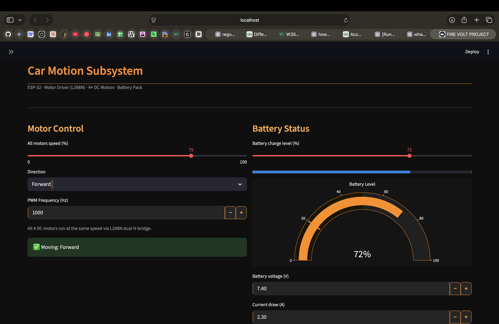

# 🔥 FireVolt Green

[](https://www.python.org)
[](https://streamlit.io)
[](https://www.espressif.com)
[](https://opensource.org/licenses/MIT)
[](https://github.com/topics/sustainability)

**A self-sustaining electrical agriculture vehicle that converts crop stubble into electricity** — solving India's stubble burning crisis while creating new revenue streams for farmers.

---

## 📋 Table of Contents
- [About the Project](#about-the-project)
- [Key Features](#key-features)
- [Three Subsystems](#three-subsystems)
- [Tech Stack](#tech-stack)
- [Screenshots](#screenshots)
- [Getting Started](#getting-started)
- [Running the Dashboard](#running-the-dashboard)
- [Project Structure](#project-structure)
- [Contributing](#contributing)
- [License](#license)
- [Team & Acknowledgments](#team--acknowledgments)

---

## About the Project

FireVolt Green is an innovative IoT-enabled agricultural vehicle designed to tackle **crop residue burning** in India. It burns stubble in a controlled chamber, converts waste heat into electricity using TEG modules, filters harmful emissions, and even turns captured carbon soot into usable ink.

This project demonstrates a complete circular economy solution: **Waste → Energy → Revenue**.

---

## Key Features
- Controlled combustion of crop stubble
- Heat-to-electricity conversion via 12–16 TEG modules
- Multi-stage filtration (HEPA + activated carbon)
- Carbon soot converted into ink
- Real-time monitoring dashboard built with Streamlit
- ESP32-based motor control for vehicle movement

---

## Three Subsystems

| Subsystem              | Main Components                                                                 | Purpose |
|------------------------|----------------------------------------------------------------------------------|--------|
| **Car Motion**         | ESP32, 2× L298N drivers, 4× DC motors, Li-ion battery                          | Autonomous / remote movement |
| **Heat → Electricity** | Combustion chamber, TEG modules, custom buck converter                          | Generate usable power from waste heat |
| **Filtration**         | HEPA filter (Ø21cm), activated carbon filter, relay-controlled fan              | Clean exhaust and capture soot for ink |

---

## Tech Stack
- **Backend & Dashboard**: Python, Streamlit, Plotly, Pandas
- **Hardware**: ESP32, Arduino, TEG modules, L298N motor drivers
- **Visualization**: Real-time graphs and system status
- **Others**: Docker/Kubernetes concepts (optional), IoT protocols

---

## Screenshots

**Dashboard Overview**  
](https://www.python.org)
[](https://streamlit.io)
[](https://www.espressif.com)
[](https://opensource.org/licenses/MIT)
[](https://github.com/topics/sustainability)

**A self-sustaining electrical agriculture vehicle that converts crop stubble into electricity** — solving India's stubble burning crisis while creating new revenue streams for farmers.

---

## 📋 Table of Contents
- [About the Project](#about-the-project)
- [Key Features](#key-features)
- [Three Subsystems](#three-subsystems)
- [Tech Stack](#tech-stack)
- [Screenshots](#screenshots)
- [Getting Started](#getting-started)
- [Running the Dashboard](#running-the-dashboard)
- [Project Structure](#project-structure)
- [Contributing](#contributing)
- [License](#license)
- [Team & Acknowledgments](#team--acknowledgments)

---

## About the Project

FireVolt Green is an innovative IoT-enabled agricultural vehicle designed to tackle **crop residue burning** in India. It burns stubble in a controlled chamber, converts waste heat into electricity using TEG modules, filters harmful emissions, and even turns captured carbon soot into usable ink.

This project demonstrates a complete circular economy solution: **Waste → Energy → Revenue**.

---

## Key Features
- Controlled combustion of crop stubble
- Heat-to-electricity conversion via 12–16 TEG modules
- Multi-stage filtration (HEPA + activated carbon)
- Carbon soot converted into ink
- Real-time monitoring dashboard built with Streamlit
- ESP32-based motor control for vehicle movement

---

## Three Subsystems

| Subsystem              | Main Components                                                                 | Purpose |
|------------------------|----------------------------------------------------------------------------------|--------|
| **Car Motion**         | ESP32, 2× L298N drivers, 4× DC motors, Li-ion battery                          | Autonomous / remote movement |
| **Heat → Electricity** | Combustion chamber, TEG modules, custom buck converter                          | Generate usable power from waste heat |
| **Filtration**         | HEPA filter (Ø21cm), activated carbon filter, relay-controlled fan              | Clean exhaust and capture soot for ink |

---

## Tech Stack
- **Backend & Dashboard**: Python, Streamlit, Plotly, Pandas
- **Hardware**: ESP32, Arduino, TEG modules, L298N motor drivers
- **Visualization**: Real-time graphs and system status
- **Others**: Docker/Kubernetes concepts (optional), IoT protocols

---

## Screenshots

**Dashboard Overview**  


**Vehicle Top View**  


**Side View & Circuit**  


---

## Getting Started

### Prerequisites
- Python 3.10 or higher
- Git
- Hardware components (ESP32 setup optional for dashboard demo)

### Installation

1. Clone the repository:
   ```bash
   git clone https://github.com/YourUsername/FireVolt-Green.git
   cd FireVolt-Green)

**Vehicle Top View**  


**Side View & Circuit**  


*(Replace the paths above with your actual image file names after uploading them to the `assets/` folder)*

---

## Getting Started

### Prerequisites
- Python 3.10 or higher
- Git
- Hardware components (ESP32 setup optional for dashboard demo)

### Installation

1. Clone the repository:
   ```bash
   git clone https://github.com/arzaanxeng/FireVolt-Green.git
   cd FireVolt-Green
