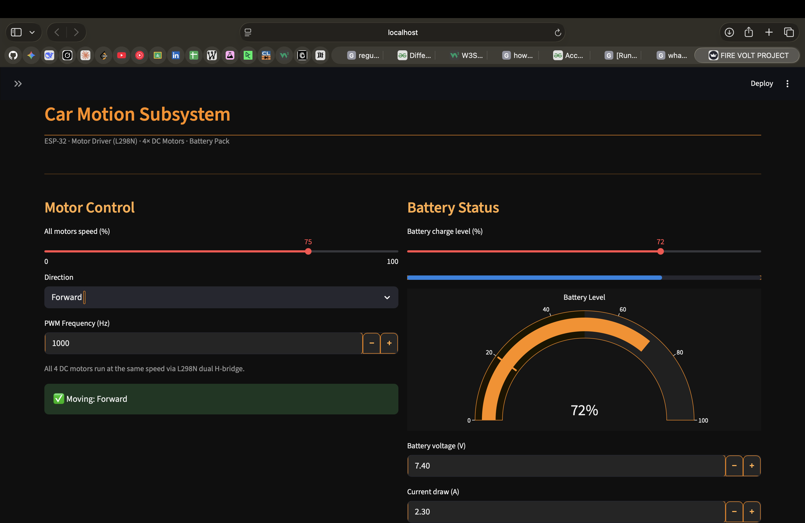
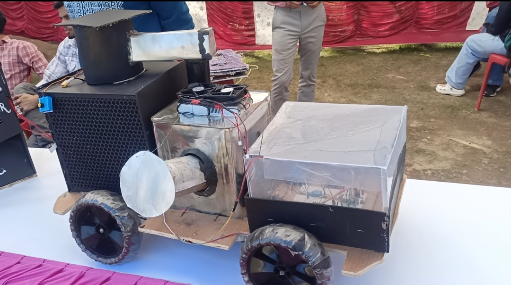
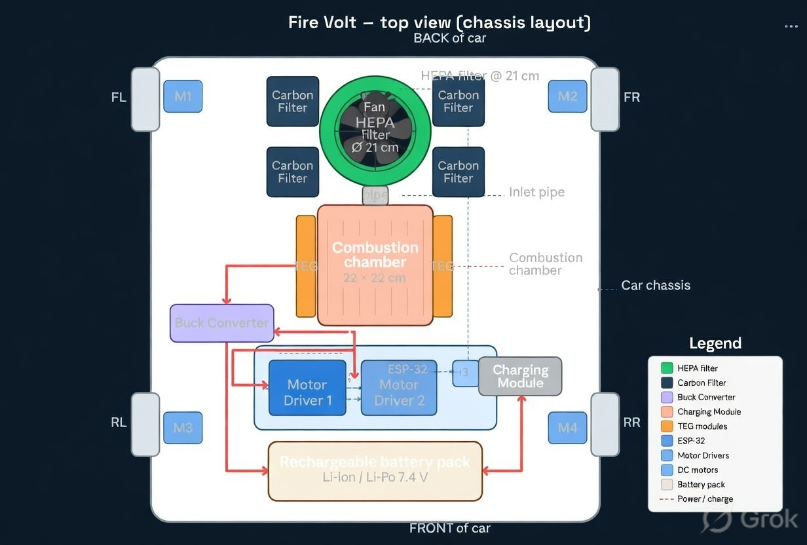

# FireVolt Green

[](https://www.python.org)
[](https://streamlit.io)
[](https://www.espressif.com)
[](https://opensource.org/licenses/MIT)
[](https://github.com/topics/sustainability)
[]()

**A self-sustaining electric agricultural vehicle that converts crop stubble into electricity** — tackling India's stubble-burning crisis while creating a new revenue stream for farmers.

> Waste → Energy → Revenue. One machine, three problems solved.

---

## Table of Contents
- [About the Project](#about-the-project)
- [The Problem](#the-problem)
- [Key Features](#key-features)
- [Three Subsystems](#three-subsystems)
- [Tech Stack](#tech-stack)
- [Screenshots](#screenshots)
- [Getting Started](#getting-started)
- [Running the Dashboard](#running-the-dashboard)
- [Project Structure](#project-structure)
- [Roadmap](#roadmap)
- [Contributing](#contributing)
- [License](#license)
- [Team & Acknowledgments](#team--acknowledgments)

---

## About the Project

**FireVolt Green** is an IoT-enabled agricultural vehicle built to tackle **crop residue (stubble) burning** in India — a practice that torches millions of tonnes of leftover paddy and wheat stalks every harvest season, choking cities in smog and wasting a resource that could otherwise generate income.

Instead of farmers burning stubble in open fields, FireVolt Green burns it in a **controlled combustion chamber**, captures the waste heat and converts it into usable electricity via thermoelectric generator (TEG) modules, filters the resulting emissions through a multi-stage filtration system, and recovers the captured carbon soot as raw material for **ink production** — turning an environmental liability into three separate value streams.

This project is a full-stack demonstration of a **circular economy solution**: **Waste → Energy → Revenue.**

---

## The Problem

- Post-harvest stubble burning is one of the largest seasonal contributors to air pollution in North India, degrading air quality across entire regions every year.
- Farmers burn stubble because it's the fastest and cheapest way to clear fields before the next planting cycle — there's little economic incentive to do otherwise.
- Existing mechanical solutions (balers, shredders) require upfront investment with no direct energy or revenue payback.

FireVolt Green is designed to change that calculus: the same stubble a farmer would otherwise burn for free becomes fuel for on-board power generation and a marketable soot-ink byproduct.

---

## Key Features

-  Controlled combustion of crop stubble in an enclosed chamber (no open-field burning)
-  Heat-to-electricity conversion via 12–16 thermoelectric generator (TEG) modules
-  Multi-stage filtration (HEPA + activated carbon) for cleaner exhaust
-  Captured carbon soot repurposed as raw material for ink
-  Real-time monitoring dashboard built with Streamlit
-  ESP32-based motor control for autonomous / remote vehicle movement

---

## Three Subsystems

| Subsystem | Main Components | Purpose |
|---|---|---|
| **Car Motion** | ESP32, 2× L298N motor drivers, 4× DC motors, Li-ion battery pack | Autonomous / remote-controlled vehicle movement across the field |
| **Heat → Electricity** | Combustion chamber, 12–16 TEG modules, custom buck converter | Converts waste combustion heat into usable, regulated electrical power |
| **Filtration & Recovery** | HEPA filter (Ø21 cm), activated carbon filter, relay-controlled fan | Cleans exhaust before release and captures soot for ink production |

For a full breakdown of how these subsystems work together — including circuit design, control logic, and engineering trade-offs — see **[Technical_Overview.md](Technical_Overview.md)**.

---

## Tech Stack

**Backend & Dashboard**
- Python
- Streamlit — real-time web dashboard
- Plotly — live sensor graphs
- Pandas — sensor data handling

**Hardware & Firmware**
- ESP32 — main microcontroller for motion + sensor telemetry
- Arduino — auxiliary control logic
- TEG (thermoelectric generator) modules — heat-to-electricity conversion
- L298N motor drivers — DC motor control
- Custom buck converter — power regulation

---

## Screenshots

**Dashboard Overview**


**Side View & Circuit**


**Top View & Circuit**


---

## Getting Started

### Prerequisites
- Python 3.10+
- pip
- (For hardware deployment) ESP32 board, Arduino IDE or PlatformIO, and the components listed in [Three Subsystems](#three-subsystems)

### Installation

1. Clone the repository:
   ```bash
   git clone https://github.com/arzaanxeng/Fire_Volt_Green.git
   cd Fire_Volt_Green
   ```

2. Create a virtual environment (recommended):
   ```bash
   python -m venv venv
   source venv/bin/activate   # On Windows: venv\Scripts\activate
   ```

3. Install dependencies:
   ```bash
   pip install -r requirements.txt
   ```

---

## Running the Dashboard

Once dependencies are installed, launch the Streamlit dashboard:

```bash
streamlit run fire_volt_dashboard_v5.py
```

The dashboard will open automatically in your browser at `http://localhost:8501`, where you can view live sensor readings, power generation stats, and system status.

> **Note:** If running without physical hardware connected, the dashboard can be run in simulation/demo mode (see `app.py` config) to explore the UI with sample data.

---

## Project Structure

```
Fire_Volt_Green/
├── ESP-32_Code/Code.cpp             # Streamlit dashboard entry point
├── assets/                          # Screenshots and images used in this README
├── dashboard/fire_volt_green_v5.py  # The main dashboard code and requirements.txt
├── TECHNICAL_OVERVIEW.md            # Deep dive into system design and engineering
└── README.md
```

---

## Roadmap

- [ ] Automate stubble-to-chamber feeding mechanism
- [ ] Add GPS-based autonomous field navigation
- [ ] Expand TEG array for higher continuous power output
- [ ] Partner with local farmer cooperatives for a field pilot
- [ ] Explore battery storage sizing for full off-grid operation

---

## Contributing

Contributions are welcome! To contribute:

1. Fork the repository
2. Create a feature branch (`git checkout -b feature/your-feature`)
3. Commit your changes (`git commit -m 'Add some feature'`)
4. Push to the branch (`git push origin feature/your-feature`)
5. Open a Pull Request

For major changes, please open an issue first to discuss what you'd like to change.

---

## License

This project is licensed under the **MIT License** — see the [LICENSE](LICENSE) file for details.

---

## Team & Acknowledgments

Built by **Arzaan** ([@arzaanxeng](https://github.com/arzaanxeng)) and team.

- Connect on [LinkedIn](https://linkedin.com/in/arzaanxeng)
- Report issues or suggest features via [GitHub Issues](https://github.com/arzaanxeng/Fire_Volt_Green/issues)

Special thanks to everyone who contributed hardware testing, field research, and design feedback during prototyping.
